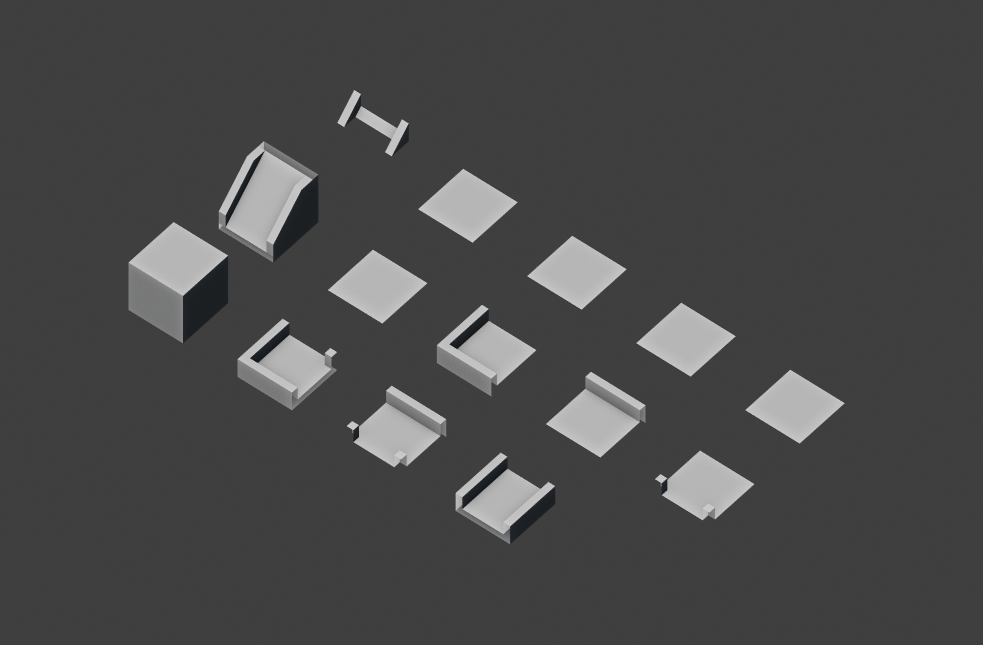
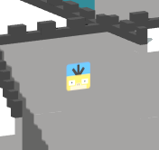

# Final Project: 3D Dungeon Generation
## Haoran Wei (whaoran)

## Demo
 - [Demo Page](https://whaoran0718.github.io/3dDungeonGeneration/)

## Techniques
### Wave Function Collapse
Wave function collapse is exactly a basic concept of quantum physics. Generally speaking, WFC here is method to determine which type of pattern or tile would appear in a specific location of a wave or domain based on a set of rules and constraints. For each collapse step, WFC does the following things until all elements are collapsed:
 - Find and choose a wave element (i.e. cell for 2D case and voxel for 3D case in this project) with the minimal nonzero entropy. A voxel has the lowest entropy means the highest certainty.
 - Fix the type of tile for the selected element based on the distribution of tiles.

Tile Models Used in the Project

### Rules and Constraints
Since it is hard to provide a prototype for automated rules generation for my 3D case, I hard code the rules and constraints manually. The issue is that rules become much more complicated when there are more tiles.

### Contradiction Resolution
Sometimes, contradiction happens when an element has no possible tiles. A simple way is to discard entirely and start a new process. However, this method would wast a long time to find a potential correct result when the domain (i.e. wave) is large. So in this project, I use a stack to record the history of generation and cancel a step when contradiction happens. To be exact, this method will always find a result unless contradictions are from the input.

Generation Process

### Collision Detection
In this project, I simplify the character collider to a set of rays laying from foot to head and do collisition detection with its surrounding triangles. On the other hand, the collier of each tile is a simplified geometry with the same topology.

Simplified Collider Geometries

### Game Play
Player can move the character in the 3D map. Player need find and touch the goal (i.e. Psyduck sticker on the wall) in the map and then play in a new level.

Psyduck Sticker

## Resources
The basic algrithm of wave function collapse is [here](https://github.com/mxgmn/WaveFunctionCollapse) and specific tutorials of WFC are presented in [Procedural Generation with Wave Function Collapse](https://gridbugs.org/wave-function-collapse/) and [Robert Heaton](https://robertheaton.com/2018/12/17/wavefunction-collapse-algorithm/). This project builds upon the C# code of [2D bitmaps generation project](https://github.com/mxgmn/WaveFunctionCollapse) and inspired by [Infinite procedurally generated city with the Wave Function Collapse algorithm](https://marian42.de/article/wfc/).